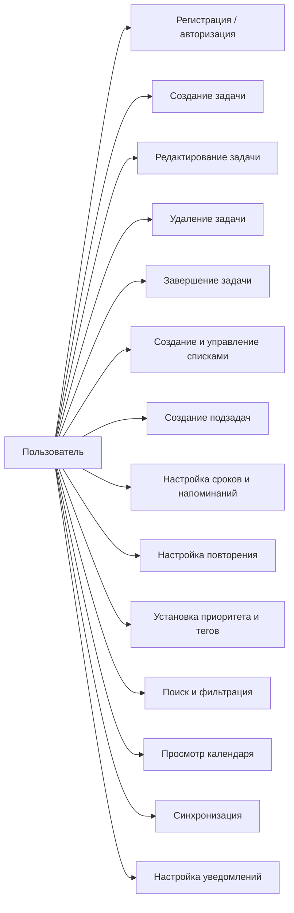

```mermaid
flowchart LR
    U["Пользователь"]

    A["Регистрация / авторизация"]
    B["Создание задачи"]
    C["Редактирование задачи"]
    D["Удаление задачи"]
    E["Завершение задачи"]
    F["Создание и управление списками"]
    G["Создание подзадач"]
    H["Настройка сроков и напоминаний"]
    I["Настройка повторения"]
    J["Установка приоритета и тегов"]
    K["Поиск и фильтрация"]
    L["Просмотр календаря"]
    M["Синхронизация"]
    N["Настройка уведомлений"]

    U --> A
    U --> B
    U --> C
    U --> D
    U --> E
    U --> F
    U --> G
    U --> H
    U --> I
    U --> J
    U --> K
    U --> L
    U --> M
    U --> N
```