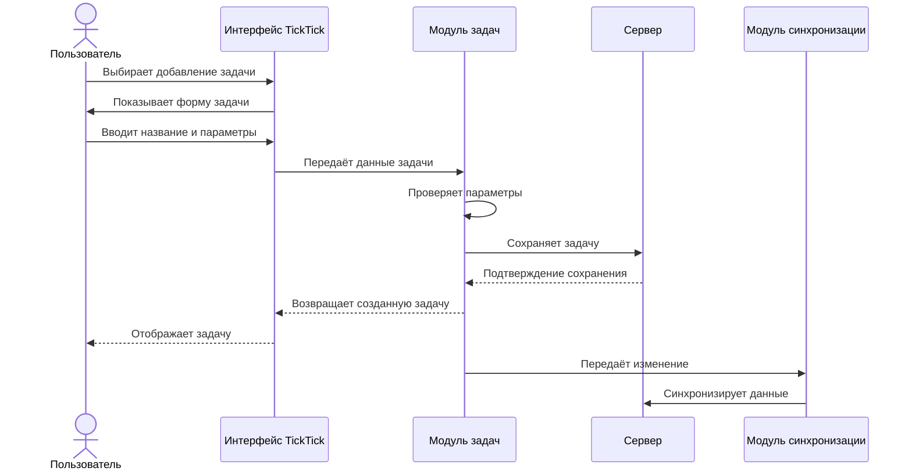

```mermaid
sequenceDiagram
    actor Пользователь
    participant UI as Интерфейс TickTick
    participant Task as Модуль задач
    participant Server as Сервер
    participant Sync as Модуль синхронизации

    Пользователь->>UI: Выбирает добавление задачи
    UI->>Пользователь: Показывает форму задачи
    Пользователь->>UI: Вводит название и параметры
    UI->>Task: Передаёт данные задачи
    Task->>Task: Проверяет параметры
    Task->>Server: Сохраняет задачу
    Server-->>Task: Подтверждение сохранения
    Task-->>UI: Возвращает созданную задачу
    UI-->>Пользователь: Отображает задачу
    Task->>Sync: Передаёт изменение
    Sync->>Server: Синхронизирует данные
```