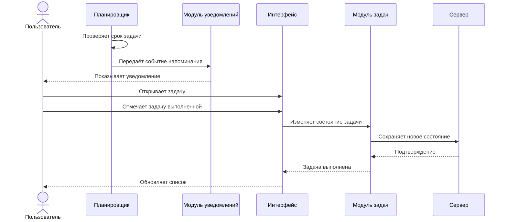

```mermaid
sequenceDiagram
    actor Пользователь
    participant Scheduler as Планировщик
    participant Notify as Модуль уведомлений
    participant UI as Интерфейс
    participant Task as Модуль задач
    participant Server as Сервер

    Scheduler->>Scheduler: Проверяет срок задачи
    Scheduler->>Notify: Передаёт событие напоминания
    Notify-->>Пользователь: Показывает уведомление

    Пользователь->>UI: Открывает задачу
    Пользователь->>UI: Отмечает задачу выполненной
    UI->>Task: Изменяет состояние задачи
    Task->>Server: Сохраняет новое состояние
    Server-->>Task: Подтверждение
    Task-->>UI: Задача выполнена
    UI-->>Пользователь: Обновляет список
```