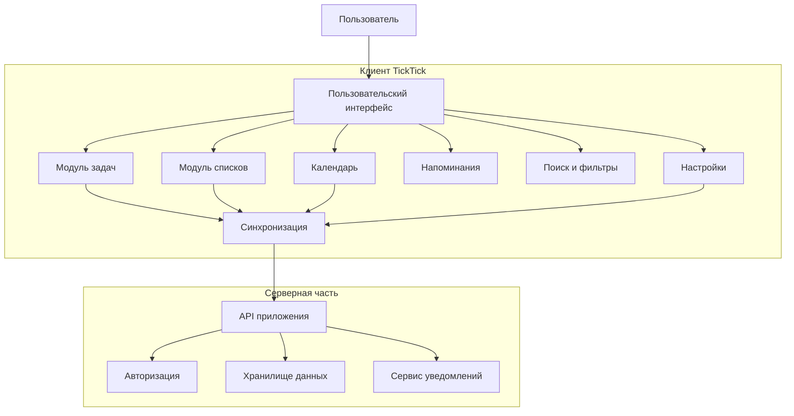

```mermaid
flowchart TB
    User["Пользователь"]

    subgraph Client["Клиент TickTick"]
        UI["Пользовательский интерфейс"]
        Tasks["Модуль задач"]
        Lists["Модуль списков"]
        Calendar["Календарь"]
        Reminder["Напоминания"]
        Search["Поиск и фильтры"]
        Sync["Синхронизация"]
        Settings["Настройки"]
    end

    subgraph Backend["Серверная часть"]
        API["API приложения"]
        Auth["Авторизация"]
        Data["Хранилище данных"]
        Notify["Сервис уведомлений"]
    end

    User --> UI
    UI --> Tasks
    UI --> Lists
    UI --> Calendar
    UI --> Reminder
    UI --> Search
    UI --> Settings

    Tasks --> Sync
    Lists --> Sync
    Calendar --> Sync
    Settings --> Sync

    Sync --> API
    API --> Auth
    API --> Data
    API --> Notify
```