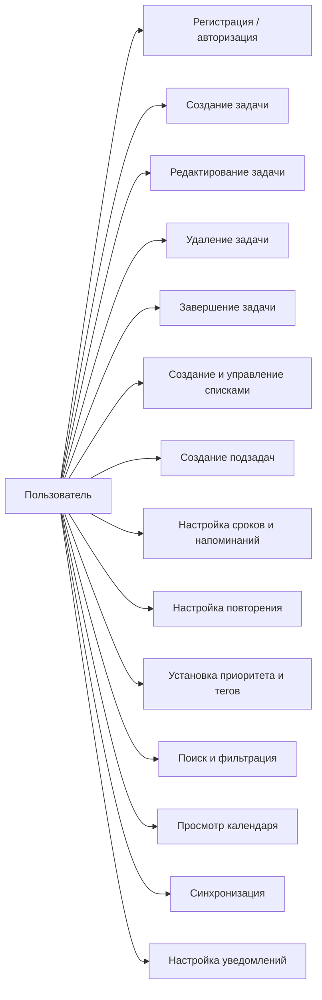
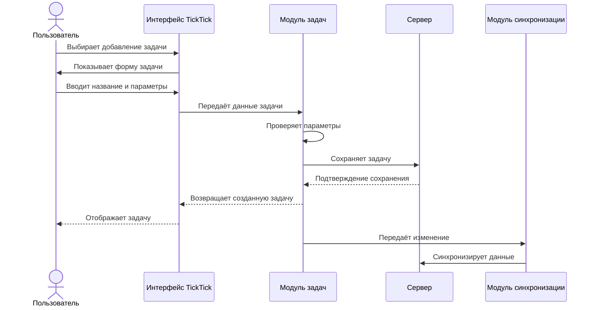
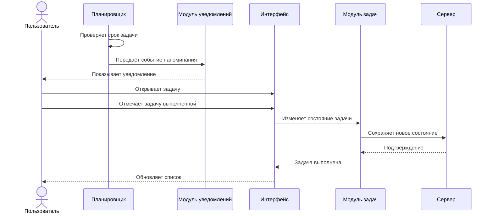
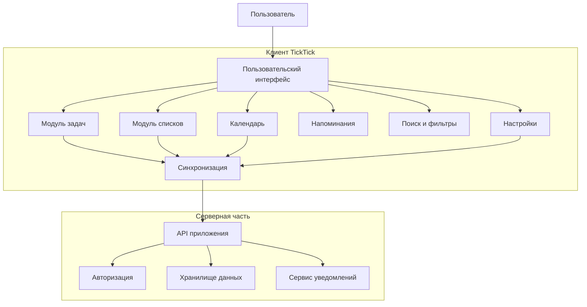

# Техническое задание на приложение TickTick 

## Общие сведения о проекте

**Исполнитель:** Нарыкина Юлия Валерьевна / ЮР.ДК-97  
**Заказчик:** Новиков М.Д. / кафедра «Безопасность в цифровом мире»  
**Сроки выполнения:** 12.09.2026 – 21.09.2026  
**Версия программного продукта:** TickTick 

---

# 1. Общие сведения

## 1.1. Наименование системы

Полное наименование системы – **TickTick**.

TickTick – программное приложение для управления задачами, планирования деятельности пользователя и организации личных и рабочих дел.

Приложение предоставляет пользователю возможность создавать задачи, задавать для них сроки выполнения и напоминания, распределять задачи по спискам, устанавливать приоритеты и использовать дополнительные средства организации информации.

Система ориентирована на использование одним пользователем и предназначена для работы с его персональными задачами и планами.

## 1.2. Основание для разработки

Основанием для разработки настоящего технического задания является необходимость формального описания функциональных и нефункциональных требований к приложению **TickTick**.

Техническое задание составлено в рамках учебной работы и предназначено для определения основных функций приложения, порядка их использования, требований к обработке данных и взаимодействию пользователя с системой.

При составлении технического задания использованы результаты анализа пользовательских функций приложения и доступные материалы разработчика.

В документе рассматриваются основные возможности системы, связанные с регистрацией и авторизацией пользователя, созданием и управлением задачами, организацией списков, использованием подзадач, сроков, напоминаний, повторений, приоритетов и тегов, а также поиском, фильтрацией, календарным представлением, синхронизацией и уведомлениями.

## 1.3. Краткая характеристика системы

**TickTick** предназначен для создания, хранения и управления пользовательскими задачами, а также для планирования деятельности и организации личных и рабочих дел.

Основным объектом системы является **задача**, содержащая информацию о запланированном действии пользователя. Для задачи могут задаваться название, описание, список, срок выполнения, напоминание, приоритет, тег и другие доступные параметры.

Для организации задач приложение предоставляет средства группировки по спискам и создания подзадач. Пользователь может разделять задачи по различным направлениям деятельности, а также формировать иерархическую структуру связанных задач.

Приложение поддерживает управление состоянием задач. Пользователь может создавать новые задачи, изменять их параметры, удалять задачи и отмечать их как выполненные.

Для планирования выполнения задач предусмотрены сроки, напоминания и повторение. Пользователь может задать время выполнения задачи, установить напоминание и определить повторение задачи в соответствии с доступными настройками.

Для дополнительной организации информации используются приоритеты и теги. Они позволяют выделять задачи по степени важности и использовать дополнительные признаки при последующей работе с ними.

Для просмотра и поиска задач приложение предоставляет несколько способов представления и обработки информации, включая:

- фильтрацию задач по заданным параметрам;
    
- поиск задач;
    
- просмотр запланированных задач;
    
- календарное представление задач.
    

Приложение также предусматривает синхронизацию пользовательских данных между поддерживаемыми устройствами, что позволяет получать доступ к актуальной информации о задачах с различных устройств.

Основные функции системы:

- регистрация и авторизация пользователя;
    
- создание задач;
    
- редактирование параметров задач;
    
- удаление задач;
    
- завершение задач;
    
- организация задач по спискам;
    
- создание и управление подзадачами;
    
- назначение сроков выполнения;
    
- установка напоминаний;
    
- настройка повторяющихся задач;
    
- установка приоритетов;
    
- добавление и использование тегов;
    
- поиск и фильтрация задач;
    
- просмотр задач в календаре;
    
- синхронизация пользовательских данных;
    
- настройка уведомлений.

---

# 2. Назначение и область применения

## 2.1 Назначение системы

Основное назначение TickTick – предоставление пользователю инструментов для планирования и контроля выполнения задач.

Система позволяет:

- создавать и изменять задачи;
- назначать дату и время выполнения;
- устанавливать напоминания;
- отмечать задачи выполненными;
- организовывать задачи по спискам;
- устанавливать приоритеты;
- создавать подзадачи;
- задавать повторение задач;
- использовать теги и фильтры;
- просматривать задачи в календарном представлении;
- синхронизировать данные между устройствами.

## 2.2 Область применения

Система применяется для организации личных, учебных и рабочих задач.

Основными пользователями являются физические лица, которым требуется вести список дел, планировать сроки выполнения и получать напоминания о запланированных действиях.

TickTick может использоваться как для отдельных задач, так и для наборов связанных дел, распределённых по спискам и категориям.

---

# 3. Функциональные требования и пользовательские сценарии

## 3.1 Регистрация и авторизация пользователя

### Назначение

Функция обеспечивает идентификацию пользователя и доступ к его персональным данным и задачам.

### Предусловия

У пользователя установлено приложение TickTick. Для операций с учётной записью и синхронизации доступно сетевое соединение.

### Основной сценарий

1. Пользователь запускает приложение.
2. Выбирает вход в существующую учётную запись или регистрацию новой.
3. Вводит необходимые данные.
4. Система проверяет предоставленные данные.
5. При успешной проверке открывается рабочее пространство пользователя.
6. Система загружает доступные пользователю списки и задачи.

### Альтернативные сценарии

- При неверных данных авторизации система сообщает об ошибке.
- При отсутствии соединения операция, требующая обращения к серверу, не выполняется.
- При попытке регистрации с уже используемыми данными система сообщает о необходимости использовать другую учётную запись.

### Результат

Пользователь получает доступ к своему рабочему пространству и сохранённым данным.

---

## 3.2 Создание и редактирование задач

### Назначение

Функция предназначена для добавления новых задач и изменения существующих.

### Предусловия

Пользователь находится в приложении и имеет доступ к списку, в котором необходимо создать задачу.

### Основной сценарий

1. Пользователь открывает нужный список.
2. Выбирает добавление новой задачи.
3. Вводит название задачи.
4. При необходимости задаёт дату и время выполнения.
5. При необходимости устанавливает приоритет, напоминание, тег и другие доступные параметры.
6. Система сохраняет задачу.
7. Задача отображается в соответствующем списке.

### Параметры задачи

| Параметр | Тип | Допустимые значения |
|---|---|---|
| Название | Текст | Непустая строка |
| Дата выполнения | Дата | Допустимая календарная дата |
| Время выполнения | Время | Значение времени суток |
| Приоритет | Перечисление | Доступный уровень приоритета |
| Напоминание | Дата/время | Настраиваемое пользователем значение |
| Список | Ссылка | Один из доступных списков |
| Тег | Текст/ссылка | Один или несколько тегов |
| Повторение | Правило | Настраиваемое правило повторения |

### Альтернативные сценарии

- Пользователь отменяет создание задачи – новая задача не сохраняется.
- Пользователь создаёт задачу без дополнительных параметров – сохраняется только основная информация.
- Пользователь указывает некорректные данные – система не принимает соответствующее значение и предлагает исправить его.

### Результат

Новая задача сохранена в выбранном списке.

---

## 3.3 Изменение и удаление задач

### Назначение

Функция позволяет изменять параметры существующей задачи и удалять ненужные задачи.

### Предусловия

В системе существует созданная пользователем задача.

### Основной сценарий редактирования

1. Пользователь выбирает задачу.
2. Открывает её параметры.
3. Изменяет необходимые данные.
4. Сохраняет изменения.
5. Система обновляет информацию о задаче.

### Сценарий удаления

1. Пользователь выбирает задачу.
2. Выбирает команду удаления.
3. Система удаляет задачу из текущего списка.

### Результат

Параметры задачи изменены либо задача удалена.

---

## 3.4 Выполнение задач

### Назначение

Функция предназначена для фиксации выполнения запланированных действий.

### Предусловия

В списке пользователя существует невыполненная задача.

### Основной сценарий

1. Пользователь открывает список задач.
2. Выбирает нужную задачу.
3. Отмечает задачу как выполненную.
4. Система изменяет состояние задачи.
5. Выполненная задача перестаёт отображаться среди текущих невыполненных задач либо перемещается в раздел выполненных.

### Альтернативный сценарий

Если задача является повторяющейся, после выполнения система формирует следующее вхождение согласно установленному правилу повторения.

### Результат

Система фиксирует выполнение задачи.

---

## 3.5 Списки и организация задач

### Назначение

Функция обеспечивает группировку задач для удобного управления ими.

### Предусловия

Пользователь авторизован в системе.

### Основной сценарий

1. Пользователь создаёт новый список.
2. Задаёт его название.
3. Система создаёт список.
4. Пользователь добавляет в него задачи.
5. Задачи отображаются внутри выбранного списка.

Пользователь может переключаться между существующими списками для просмотра соответствующих задач.

### Результат

Задачи распределены по выбранным спискам.

---

## 3.6 Подзадачи

### Назначение

Функция предназначена для разделения сложной задачи на отдельные действия.

### Предусловия

Существует основная задача.

### Основной сценарий

1. Пользователь открывает задачу.
2. Добавляет подзадачу.
3. Вводит название подзадачи.
4. Система связывает подзадачу с основной задачей.
5. Пользователь может отдельно отметить подзадачи выполненными.

### Результат

Сложная задача представлена в виде основной задачи с набором связанных подзадач.

---

## 3.7 Сроки, напоминания и повторение задач

### Назначение

Функция позволяет контролировать сроки выполнения задач и уведомлять пользователя о необходимости выполнить запланированное действие.

### Основной сценарий

1. Пользователь создаёт или открывает задачу.
2. Указывает дату и, при необходимости, время выполнения.
3. Настраивает напоминание.
4. При необходимости задаёт правило повторения.
5. Система сохраняет параметры.
6. В установленное время система формирует уведомление.

### Возможные параметры

| Параметр | Тип | Допустимые значения |
|---|---|---|
| Дата выполнения | Дата | Любая допустимая дата |
| Время | Время | Допустимое время суток |
| Напоминание | Дата/время | Настраиваемое значение |
| Повторение | Правило | Периодическое или пользовательское правило |

### Альтернативные сценарии

- Пользователь переносит срок выполнения.
- Пользователь изменяет время напоминания.
- Пользователь отключает напоминание.
- Пользователь изменяет правило повторения.

### Результат

Задача получает заданные параметры планирования и напоминания.

---

## 3.8 Приоритеты и теги

### Назначение

Функция предназначена для дополнительной классификации задач и последующего поиска или фильтрации.

### Основной сценарий

1. Пользователь открывает параметры задачи.
2. Устанавливает необходимый уровень приоритета.
3. При необходимости добавляет один или несколько тегов.
4. Система сохраняет параметры.
5. Задача отображается с установленными характеристиками.

### Результат

Пользователь получает возможность выделять важные задачи и группировать их по дополнительным признакам.

---

## 3.9 Фильтрация и поиск задач

### Назначение

Функция позволяет находить задачи и отображать только те элементы, которые соответствуют заданным условиям.

### Основной сценарий

1. Пользователь открывает поиск или фильтр.
2. Вводит поисковый запрос либо выбирает условия фильтрации.
3. Система анализирует доступные пользователю задачи.
4. Отображаются задачи, соответствующие условиям.

### Возможные условия

- список;
- тег;
- приоритет;
- дата;
- состояние выполнения;
- другие доступные параметры.

### Результат

Пользователь получает сокращённый набор задач, соответствующий заданным условиям.

---

## 3.10 Календарное представление

### Назначение

Функция предназначена для просмотра запланированных задач в привязке к датам.

### Основной сценарий

1. Пользователь открывает календарь.
2. Выбирает необходимый период.
3. Система отображает задачи, имеющие соответствующие даты.
4. Пользователь выбирает дату.
5. Система отображает задачи, запланированные на выбранный период.
6. При необходимости пользователь изменяет параметры задачи.

### Результат

Пользователь получает визуальное представление своего расписания.

---

## 3.11 Синхронизация данных

### Назначение

Функция обеспечивает актуальность задач пользователя на поддерживаемых устройствах.

### Основной сценарий

1. Пользователь авторизуется в своей учётной записи.
2. Система устанавливает соединение с сервером.
3. Выполняется обмен данными.
4. Изменения пользователя сохраняются в учётной записи.
5. Актуальные данные становятся доступны на других поддерживаемых устройствах.

### Альтернативный сценарий

При отсутствии соединения операция синхронизации откладывается до восстановления связи. Конкретное поведение автономной работы следует проверять на используемой сборке 6.3.6.0.

### Результат

Данные пользователя синхронизированы между доступными устройствами.

---

## 3.12 Уведомления и настройки

### Назначение

Функция обеспечивает управление поведением приложения и уведомлениями.

### Основной сценарий

1. Пользователь открывает настройки.
2. Выбирает необходимый раздел.
3. Изменяет доступные параметры.
4. Система сохраняет изменения.
5. Новые параметры применяются при последующей работе приложения.

### Результат

Работа приложения и уведомлений соответствует настройкам пользователя.

---

## 3.13 Общая последовательность использования приложения

Типовая последовательность работы пользователя:

1. Запуск TickTick.
2. Авторизация.
3. Открытие списка задач.
4. Создание новой задачи.
5. Указание названия.
6. Назначение срока и напоминания.
7. Установка приоритета или тега.
8. При необходимости добавление подзадач.
9. Сохранение задачи.
10. Просмотр задач в списке или календаре.
11. Получение напоминания.
12. Выполнение задачи.
13. Отметка задачи как выполненной.
14. Синхронизация изменений.

---

# 4. Нефункциональные требования

## 4.1 Производительность

1. Основные локальные операции интерфейса должны выполняться без заметной задержки для пользователя.
2. Открытие списка задач и отображение уже загруженных данных не должно приводить к длительному блокированию интерфейса.
3. При работе с серверными функциями приложение должно отображать состояние выполняемой операции.
4. При длительном ожидании система не должна блокировать интерфейс без уведомления пользователя.

Для учебного проекта допустимо принять целевое требование: обычные локальные операции — до 1 секунды, стандартные серверные операции — до 3 секунд при нормальном сетевом соединении.

## 4.2 Ответы сервера и обработка ошибок

1. При успешном выполнении серверной операции приложение отображает актуальное состояние данных.
2. При отсутствии соединения пользователь получает сообщение о невозможности выполнить операцию.
3. Ошибки сервера не должны приводить к аварийному завершению приложения.
4. При временной недоступности сервера приложение сохраняет введённые пользователем данные настолько, насколько это позволяет текущий режим работы, и повторяет операцию после восстановления соединения.
5. Сообщения об ошибках должны быть понятны пользователю и не содержать служебной информации.

## 4.3 Безопасность

1. Доступ к персональным данным предоставляется только авторизованному пользователю.
2. Передача данных между приложением и сервером должна выполняться по защищённому соединению.
3. Сервер проверяет права пользователя при обращении к его задачам и спискам.
4. Пользователь не должен получать доступ к данным других пользователей без соответствующего разрешения.
5. Данные учётной записи и задачи должны храниться и передаваться с использованием предусмотренных системой механизмов защиты.
6. Доступ приложения к ресурсам устройства должен осуществляться только при наличии соответствующих разрешений.

---

# 5. UML-диаграммы

## 5.1 Диаграмма вариантов использования

## 5.2 Диаграмма последовательности: создание задачи

## 5.3 Диаграмма последовательности: напоминание и выполнение задачи

## 5.4 Архитектурная диаграмма

---
